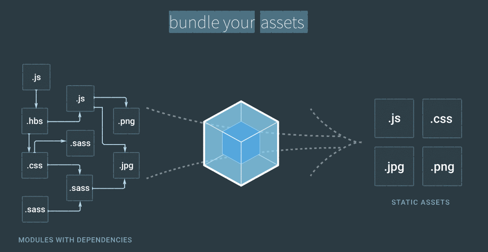
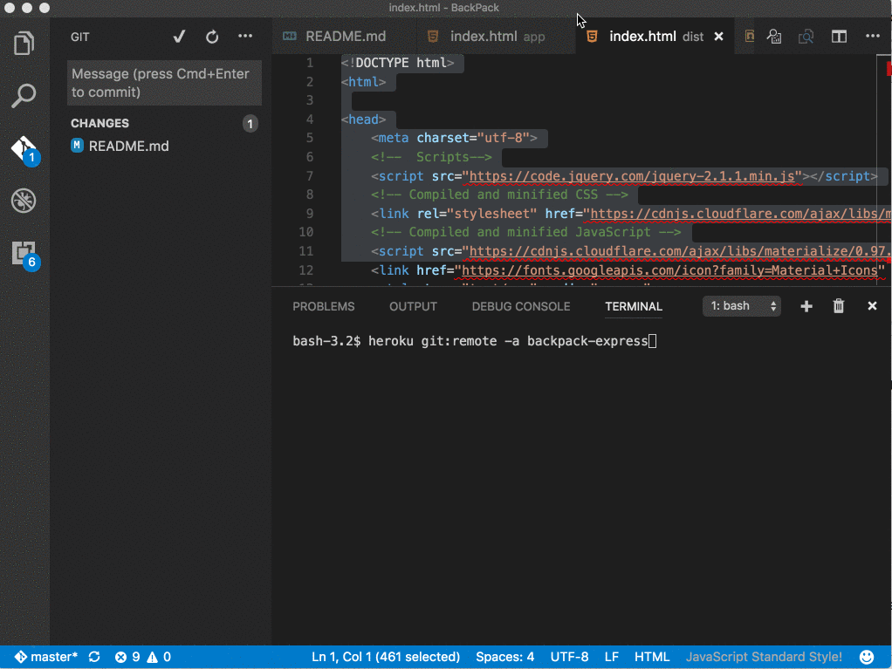
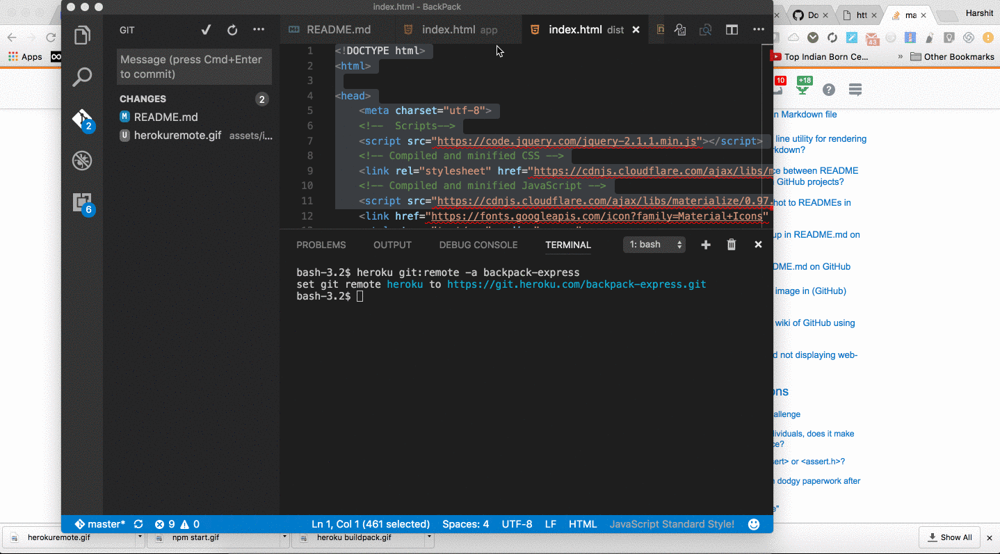

 </img>

# BackPack: Boilerplate Template for Webpack2 and Heroku

[Webpack 2](https://webpack.js.org/) is super cool, I wrote a sample boiler code that you can reuse to spin a [Express](http://expressjs.com/) application and setup to deploy to [Heroku](https://www.heroku.com/) instantly.

Few things to remember that :

 - **No Fancy** framework or platform are used here, this is clear naked/raw boilerplate, and I'll let you decide to pick your faviorte framework on top of this.

 - This boilerplate use [HMR](https://webpack.js.org/concepts/hot-module-replacement/) and it is cool.

</img>

## How to get started ?

Clone this code and follow these instructions

- `npm i`
- `npm start`
- Visit [http://localhost:3000/](http://localhost:3000/)

<!--</img>-->

## Deploy

First, you'll need a heroku account.

- In Heroku, create a new app
- Add a new buildpack, select `heroku/nodejs`. This should set you up to automatically run `npm install` which is what you'll need to get up and running.

</img>

- Follow the instructions to [link to your repository](https://devcenter.heroku.com/articles/git).

</img>

- `git push heroku master` - Assuming you've set everything up correctly, this will deploy your app, and run the postinstall script in `package.json`.

</img>

